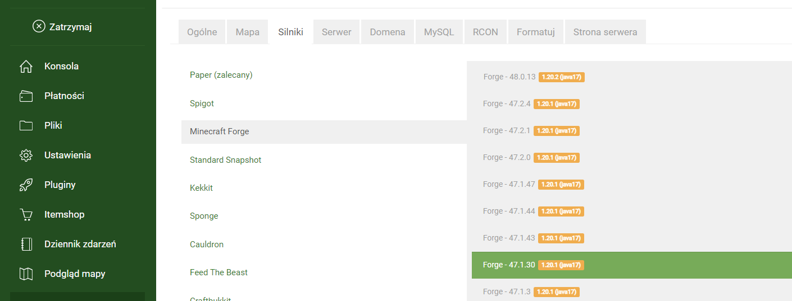
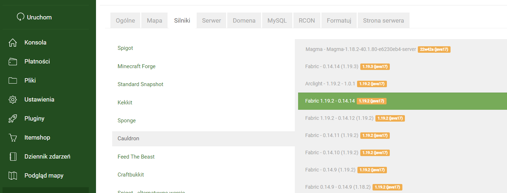
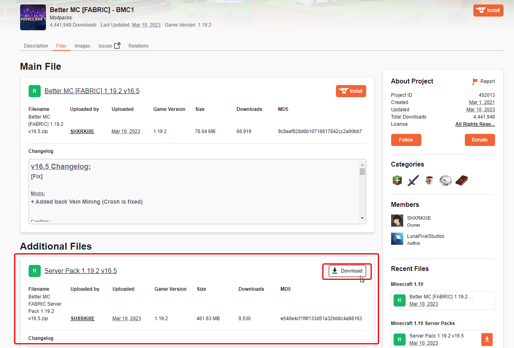
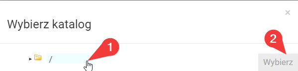
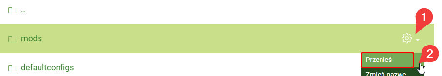

# Modpack Installation

### Requirements

* A Minecraft server supporting Fabric / Forge modifications (for Craftserve: Diamond package)

### Installation

1. Delete the current map files from the server. You can use the **Format** -> **All files** function, which can be found in the settings.
   *Note: Formatting the server will result in the loss of all files, including all elements saved on the map.*

    
2. Select the recommended version of the Forge or Fabric engine as specified by the modpack author.
   - You can set the Forge engine in the **Settings** -> **Engines** -> **Minecraft Forge** section of the Craftserve panel.
     
     
   - Fabric engines are located in the **Settings** -> **Engines** -> **Cauldron** section of the Craftserve panel.
     
     
   - Remember to save the selected engine after choosing it. To do this, scroll to the bottom of the page and click the **Save** button.
     
     
3. Download the **server** version of the modpack, for example, from [this website](https://www.curseforge.com/minecraft/modpacks).

    
4. Upload the downloaded zip file to the server using [FTP](ftp.md).
5. Go to the Craftserve panel and select the **Files** tab.
6. Locate the uploaded zip file and select the **Unzip** option next to it.

    
    - Choose **/** as the destination folder.
      
      
7. After unzipping, you can delete the zip file.
8. The unzipped modpack folder should now appear in the server's root directory. Open this folder.
9. Move the files from this folder to the main server directory. The important files include the **mods**, **config**, **defaultconfigs** folders, and the **server.properties** file.
    - You can use the **Move** function for each of these elements, selecting **/** as the destination folder.
      
      
10. Delete the extracted modpack folder, as it no longer contains essential files.
11. Start the server and wait for it to launch.

### Notes
- Players can join the server only if they have the same version of the modpack installed on their game (but the client version).
- If you encounter issues starting the server, ensure that the Fabric/Forge engine version matches the modpack version.