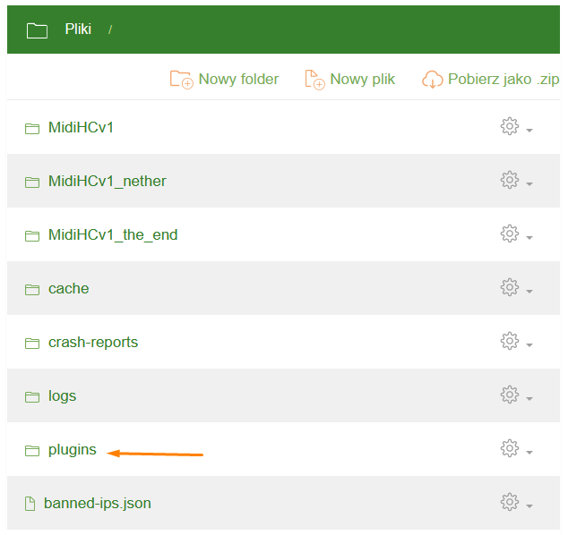

Plugin Installation
==============================
**Craftserve Panel** does have a tab for automatic plugin installation, however, this feature does not work very well. Installation often ***fails to complete***, and if it does succeed, the installed plugin version ***is not supported*** by the given engine.

Therefore, to install plugins, it is best to use the traditional method - via **FTP** or the **Files** tab in the Craftserve panel. To run plugins, we need one of the engines that supports them, such as:

Bukkit, Spigot, and Paper
------------------------
Plugins for these engines can be downloaded from the websites [Bukkit.org](https://dev.bukkit.org/bukkit-plugins) and [SpigotMC](https://www.spigotmc.org/resources/categories/spigot.4/). Other sites might send us harmful software instead of plugins.

Before downloading a plugin, make sure it is compatible with our version of Minecraft. After downloading the plugins with the **.jar** extension, simply copy them to the **/plugins/** folder on our server:

Sponge
--------------------
The Sponge engine has an API completely different from Bukkit, Spigot, or Paper, which is why plugins from these engines are not compatible with each other. Sponge plugins can be downloaded from the [SpongePowered](https://ore.spongepowered.org/) website. Just like with the previous engines, simply upload the appropriate plugin version to the **/plugins/** folder on our server.

Unfortunately, the Sponge plugin library is significantly smaller than those of Bukkit and Spigot.

Installation
----------
To manage files, you can use the **Files** tab in the Craftserve panel or the **FTP** protocol with an FTP client, such as **[WinSCP](https://github.com/Craftserve/docs/blob/master/ftp.md)**
