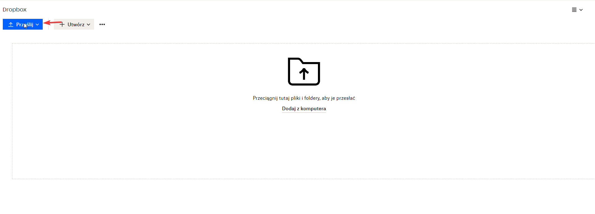
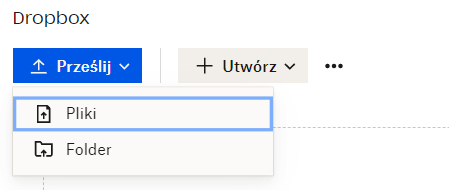
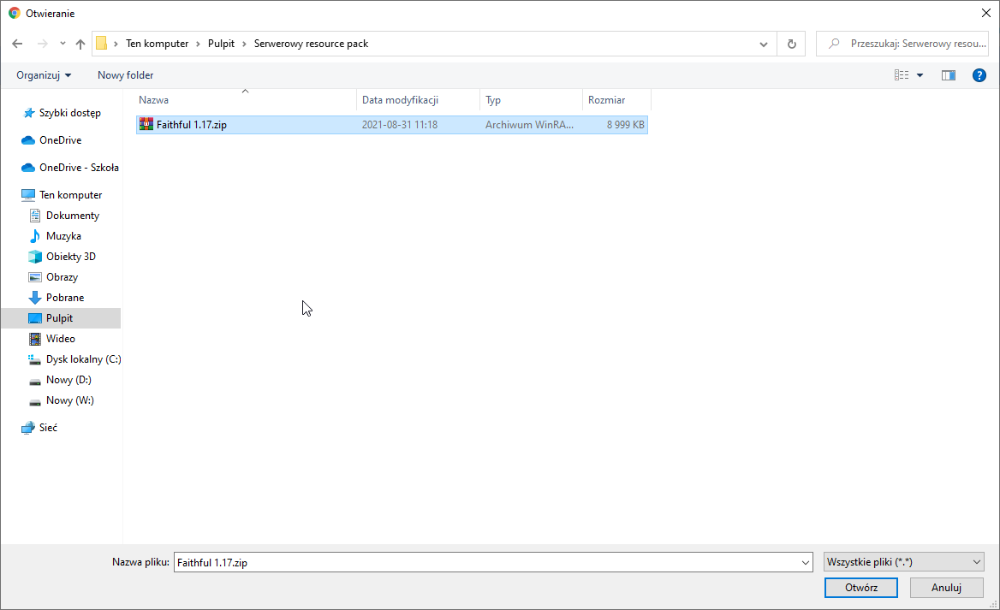
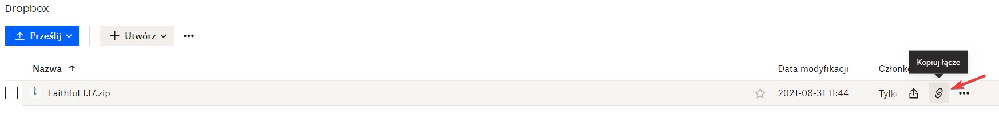
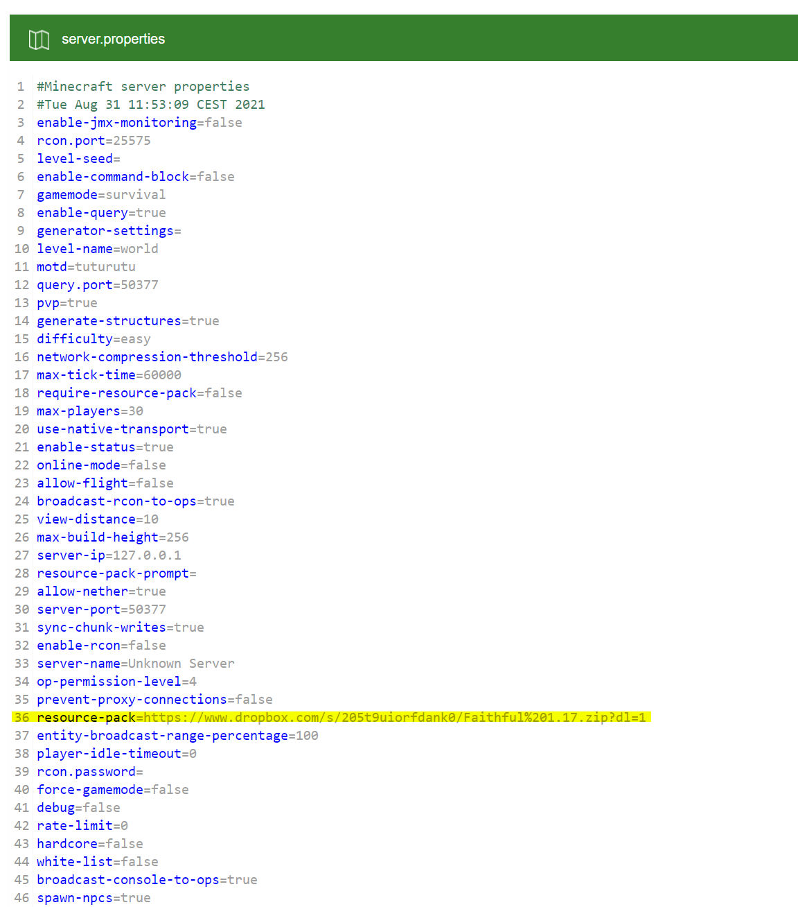

# Server Resource Pack
## Download Link
### Public Resource Pack

To upload a resource pack to the server, we need a direct download link. To get it, right-click on the button that triggers the download of the resource pack. Then, copy the link address.

### Resource Pack from Your Computer

If you want to upload your own resource pack to the server, you need to upload it to any service that provides a direct permalink for download. You can use services like [Dropbox](https://www.dropbox.com/). 
To do this:
* Drag your resource pack to the center of the page or click the **upload** button.
  

* Select **files**.

* Find the resource pack you want to upload.

* Then click **open**.

Now copy the link to your resource pack by clicking the **copy link** button.

## Uploading the Resource Pack to the Server
Once you have the link, navigate to the server's **server.properties** file. It is located in the main directory of your server. 
Look for the line **resource-pack=** and paste the link there.

# IMPORTANT
If you're using Dropbox, make sure to change the **0** at the end of the link to **1**.
