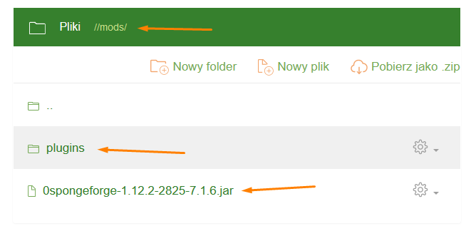

SpongeForge
===========
The vanilla **Forge** engine does not support any plugins; however, by making certain compromises, we can run plugins intended for the **Sponge** engine. To do this, simply download and install the **SpongeForge** mod. To get it, download the appropriate version of [**SpongeForge** from the SpongePowered website](https://www.spongepowered.org/downloads/spongeforge/stable/1.12.2), ensuring that the mod version is compatible with your **Forge** - look for the red background icon:

**Forge** loads mods in alphabetical order, so it’s best to rename the downloaded file to something like **0spongeforge.jar** and then place it in the **/mods/** folder on your server.

You can download **Sponge** plugins from the [SpongePowered website](https://ore.spongepowered.org/). Downloaded plugins with the **.jar** extension can be placed in the **/mods/** or **/mods/plugins/** folder:

Warning!
--------
If a plugin uses **MIXIN**, it must be placed in the **/mods/** folder.

Installation
------------
You can manage files by using the **Files** tab in the Craftserve panel or the **FTP** protocol with an FTP client, such as **FileZilla**:

