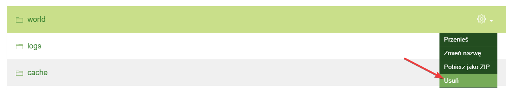
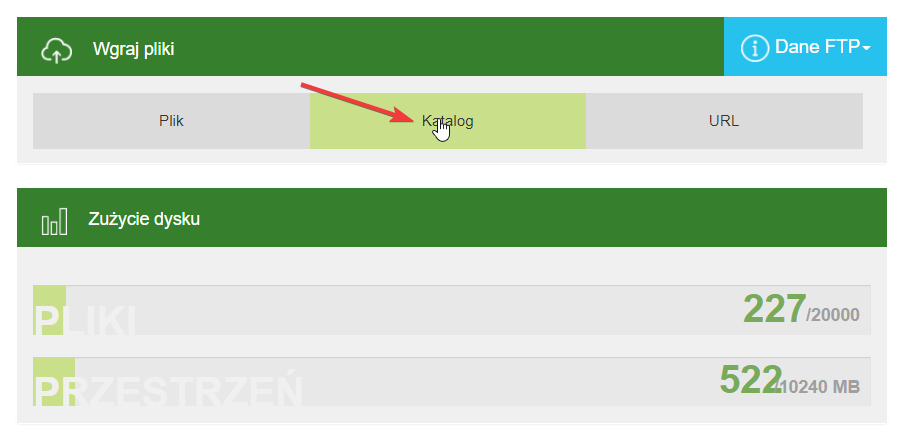
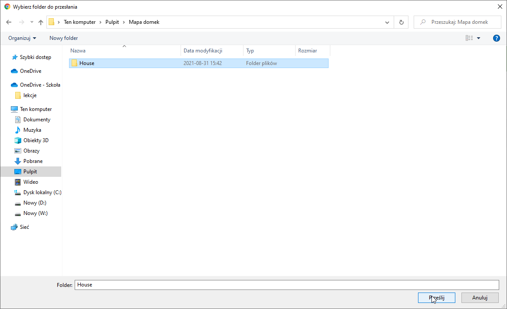
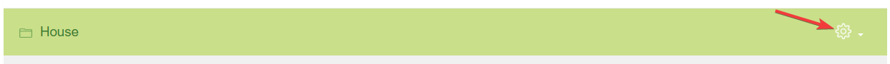
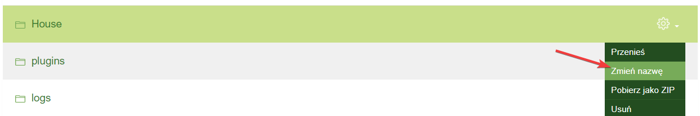
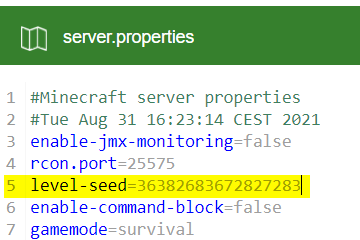
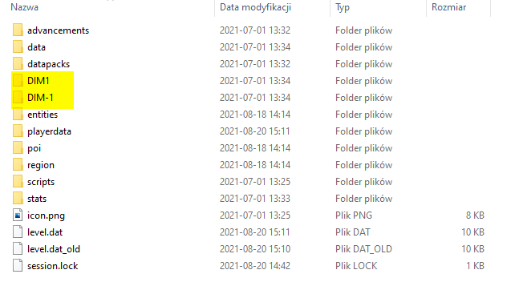

# Server World
## Table of Contents
* [Creating a New World](#creating)
* [Uploading Your Own Map](#uploading)
* [Setting Your Own Seed](#seed)
* [Moving the World from Server to Singleplayer](#dim)

## Creating a New World
To create a new map, follow these steps:
* Turn off the server
* Access the server files
* Delete the world by removing the folders **world**, **world_nether**, and **world_the_end**. If the world name has been changed in the **server.properties** file or in the server panel, delete the folders **<c. name>**, **<c. name>_nether**, and **<c. name>_the_end**. (If you want to keep the map, it is recommended to download it to your computer, preferably using **[FTP](https://github.com/Craftserve/docs/blob/master/ftp.md)**).

* If the **level-seed** line in the **server.properties** file contains the world seed, remove it and save the file to generate a new, different one. Otherwise, only the progress will be reset.
* Start the server

## Uploading Your Own Map
To upload your own world, follow these steps:
* Turn off the server
* Access the server files
* Delete the old world (instructions on how to do this are above)
* Upload your world to the main server folder

(When the upload progress reaches 100%, the file has been uploaded. At that point, click **X**. Otherwise, this message will not disappear.)

* Rename the folder to **world**

* Start the server

## Setting Your Own Seed
To set your own seed, follow these steps:
* Turn off the server
* Go to the main server directory
* Open the **server.properties** file
* Enter your seed in the **level-seed=** line

* Save the file
* Delete the old world (information on how to do this is at the top)
* Start the server

## Moving the World from Server to Singleplayer
To move the world from the server to your computer, follow these steps:
* Download your world
* Go to the Nether folder and download the **DIM-1** folder
* Go to the End folder and download the **DIM1** folder
* Press **Windows + R** and type: **%appdata%**
* Open the **.minecraft** folder, then the **saves** folder
* Upload the downloaded world to the **saves** folder
* Place the **DIM-1** and **DIM1** folders into the world folder

