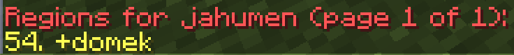

# WorldGuard - Guide

The main purpose of WorldGuard is to protect the world.

## Installation
*WorldGuard requires the WorldEdit plugin to function properly.*

1. Download the WorldEdit plugin from the [official website](https://dev.bukkit.org/projects/worldedit).
2. Copy the WorldEdit.jar file to the plugins folder.
3. Download the WorldGuard plugin from the [official website](https://dev.bukkit.org/projects/worldguard).
4. Copy the WorldGuard.jar file to the plugins folder.
5. Start the server.

## Creating and Editing Regions

### Creating Regions
To create a region, you must first select the area using the WorldEdit plugin.  
While holding a wooden axe, click LMB to select the first point, then click RMB to select the second point. You can create the wooden axe yourself or get it with the command `//wand`.  
The selection will be made by connecting these two points.  

WorldGuard supports regions in the form of polygons. For more information on using WorldEdit, refer to the dedicated [guide](https://github.com/Craftserve/docs/blob/master/worldedit.md).

After selecting the area, use the command `/rg define <region_name> [owner]`.  
The region name is a unique ID for the region. You cannot create two regions with the same name in one world. The name cannot contain spaces.  
Providing the `owner` argument will assign the region's owner (more information below).

Once the region is created, players will automatically not be able to perform any undesired actions, such as editing blocks, opening chests, doors, riding animals, minecarts, etc., within it. By default, only administrators with the appropriate permission or players added as members or owners can modify the region.

### Editing the Region Area
If you want to edit the area covered by the region, create a new selection using WorldEdit, then enter the command `/rg redefine <region_name>`.

### Deleting a Region
To delete a region, use the command `/rg delete <region_name>`.

## Checking Information About Regions

* `/rg info <region_name>` - This command will display all information about a specific region.  

* `/rg list [-p player] [page]` - This command will display a list of all regions. It supports the `-p player` flag (e.g., `/rg list -p jahumen`), which allows you to check the list of regions a specific player is added to.  
  

* By holding the *default* skin, right-click on any block to display information about the region located there.

## Members

Members are people who have permissions to edit blocks within the region, open chests, etc., but they cannot modify flags, add other members, etc.

### Adding Members
`/rg addmember <region_name> <member>`  
In the `member` field, you can enter either the player's nickname or a group in the format `g:admin`.

### Removing Members
`/rg removemember <region_name> <member>`

## Owners

Region owners have permissions to edit other owners, members, flags, etc. (they manage the region).  
The first owner is added by default with the `/rg define <region_name> [owner]` command.

### Adding Owners
`/rg addowner <region_name> <owner>`  
In the `owner` field, you can enter either the player's nickname or a group in the format `g:admin`.

### Removing Owners
`/rg removeowner <region_name> <owner>`

## Flags

By default, you cannot build, edit blocks, etc., within a created region, but you can modify these settings for a specific region using flags.  
`/rg flag <region_name> <flag> [state]`  
If you do not specify the state for the flag, it will be set to the default state, meaning the flag will be removed.  
The command also supports adding flags that apply only to specific groups, in the format `g:admin`.

### Most Popular Flags
* `passthrough` (allow/deny) - This flag makes the region use flags from the parent region.
* `build` (allow/deny) - This flag allows building in the region.
* `interact` (allow/deny) - This flag allows interactions, such as opening doors, chests, pressing buttons, etc.
* `use` (allow/deny) - This flag allows opening doors, pressing buttons, etc., but **does not** allow opening chests.
* `pvp` (allow/deny) - This flag allows players to deal damage to each other.
* `tnt` (allow/deny) - This flag allows TNT explosions.
* `mob-spawning` (allow/deny) - This flag allows mob spawning.
* `deny-spawn` (list) - This flag specifies a list of mobs that cannot spawn in the given cuboid, e.g., `pig,cow`.
* `enderman-grief` (allow/deny) - This flag allows Endermen to destroy terrain.
* `fire-spread` (allow/deny) - This flag allows fire to spread.
* `creeper-explosion` (allow/deny) - This flag allows creeper explosions.
* `snow-fall` (allow/deny) - This flag allows snow to fall.
* `snow-melt` (allow/deny) - This flag allows snow to melt.
* `ice-melt` (allow/deny) - This flag allows ice to melt.
* `leaf-decay` (allow/deny) - This flag allows leaves to decay.
* `enderpearl` (allow/deny) - This flag allows teleportation using Ender Pearls.
* `chorus-fruit-teleport` (allow/deny) - This flag allows teleportation using Chorus Fruit.
* `item-pickup` (allow/deny) - This flag allows picking up items.
* `item-drop` (allow/deny) - This flag allows dropping items.
* `invincible` (allow/deny) - This flag makes players in the region invincible.
* `fall-damage` (allow/deny) - This flag prevents fall damage in the region.
* `blocked-cmds` (list) - The list of commands that are unavailable in the region, e.g., `spawn,warp,home`.
* `greeting` (text) - A message that will display to a player when they enter the region.
* `farewell` (text) - A message that will display to a player when they leave the region.

You can view a list of all flags with the command `/rg flags [region_name]`.  
There are also [plugins](https://www.spigotmc.org/resources/worldguard-extra-flags.4823/) that add more flags.

## Region Priority

In some cases, more than one region can exist in the same area. In this case, a player must be added to each region in order to perform actions like destroying blocks. If regions have different priorities, the rules of the region with the highest priority will apply.

`/rg setpriority <region_name> <priority>`  
The default priority is `0`, but you can modify it for specific regions (both positive and negative values).

Example uses:  
* Creating a chest at spawn that players can open while all other chests are locked. In this case, create the region `chest` around the chest, then set a flag that allows using chests: `/rg flag chest use allow` and set the region's priority higher than that of spawn, e.g., `/rg setpriority chest 10`.  

* Creating a PvP zone at spawn where players can fight each other. In this case, create the region `arena` around the arena, then set a flag that allows PvP: `/rg flag arena pvp allow` and set the region's priority higher than that of spawn, e.g., `/rg setpriority arena 10`.

## Inheritance (Parent)

Inheritance defines the structure of regions (parent <- child). Inheritance works similarly to priorities, but regions lower in the structure inherit flags and members from the parent regions above them.  
`/rg setparent <region_name> [parent_region_name]`  
`region_name` is the name of the region that will be lower in the structure (inheriting flags and members).  
`parent_region_name` is the name of the region that will be higher in the structure (providing flags and members).  
To remove the parent (disconnect the region), simply do not provide a `parent_region_name`.

Example of creating a hierarchy:  
  
1. Create all the planned regions and set their appropriate flags.  
2. Set the parent `city` for regions `shop`, `mall`, `plots`, and `store`, e.g., `/rg setparent plots city`.  
3. Set the parent `shop` for regions `shop-1`, `shop-2`, `shop-3`, e.g., `/setparent shop-1 shop`.  
4. Set the parent `plots` for regions `plot-1`, `plot-2`, `plot-3`, e.g., `/setparent plot-1 plots`.

Example use:  
* Creating shops within a mall, where only specific players can use them, but the mall's management should have access to all the shops. In this case, first create the `mall` region, set the appropriate flags, and add the management members. Then, create smaller regions for specific shops like `shop-1`, `shop-2`, and so on. Add the shop owners to these regions and set the appropriate flags. Assign the shop regions as children of the mall - `/rg setparent shop-1 mall`, `/rg setparent shop-2 mall`, etc.  
* Creating plots for players in a city, where only people working with the city should have access - the process is the same as above.

## Teleporting to a Region

To teleport to a region, you can use the `/rg tp <region_name>` command.  

## Global Region

There is a region called `__global__` that covers the entire world. By default, it has no flags. It has the lowest priority, so creating any other region will overwrite it.  
You can use it when you want to prevent players from fighting or building on a specific world, for example, `/rg flag __global__ pvp deny`, `/rg flag __global__ build deny`.

Example use:
* Blocking creeper explosions in the world `world`. To do this, teleport to the `world` world and use the command `/rg flag __global__ creeper-explosion deny`.

