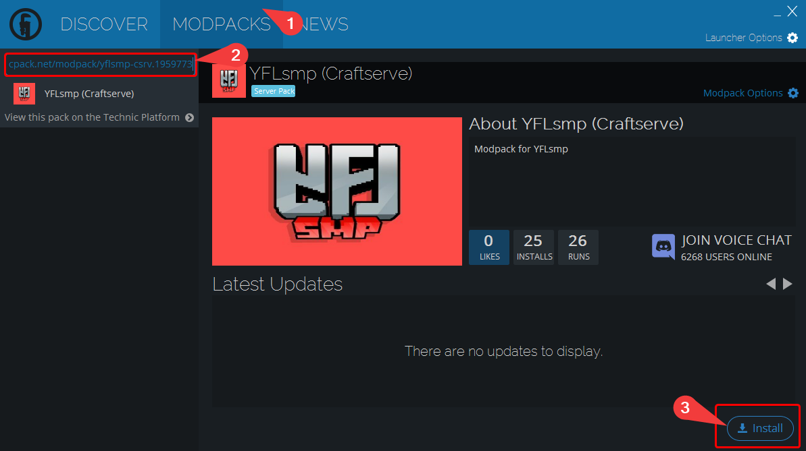
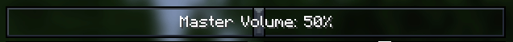

# Installation of the YFLsmp Package

### Requirements

* Minecraft server on Craftserve running on the Diamond package

<hr><br><br/>

# --> [Installation on the NEW CRAFTSERVE.COM PANEL](https://craftserve.com/m/yflsmp-s1) <--

More details here: [CLICK](https://github.com/Craftserve/docs/blob/c3/docs/yflsmp.md)
<br><br><hr/>

<a id="server"></a>
### Server Installation

1. Remove the current map files from the server. You can use the **Format** -> **All Files** option, found in the settings.
   *Note: Formatting the server will result in the loss of all existing files, including all elements saved on the map.*

   
2. Select the YFLsmp engine.
    - You can set this engine in the **Settings** -> **Engines** -> **Square Massacre** section of the Craftserve panel.

      
    - Remember to save the engine after selecting it. To do this, go to the bottom of the page and click the **Save** button.

      

3. Go to the Craftserve panel and select the **Files** tab.
4. Find the `config/PlasmoVoice` folder and open the `server.yml` file.
   - In the `udp.port` field, set the value between 8000 and 10000.

     
5. Start the server.

<a id="client"></a>
### Installation on Players' Computers

To join the server, players must have the YFLsmp package installed. Follow the steps below:
1. [Download TechnicLauncher](https://www.technicpack.net/download).
2. Install TechnicLauncher. Java version 8 is required, preferably from the [Adoptium](https://adoptium.net/en-GB/temurin/releases/?version=8) environment.
   - It's worth mentioning that **the Java version for x64 architecture is required**.
   - For Windows, select this version:

     
3. Launch TechnicLauncher and log in.
4. In the **Modpacks** tab, paste the following link in the search bar: 
    ```
    https://www.technicpack.net/modpack/yflsmp-csrv.1959773
    ```
5. Install the pack by clicking the **Install** button.

   
6. It’s recommended to ensure that the appropriate amount of RAM is allocated for the pack.
   - For YFLsmp, **8GB of RAM** is recommended (if you have at least 16GB on your computer, otherwise at least **5GB** is recommended).
   - In TechnicLauncher, to change the amount of allocated RAM, go to **Launcher Options**, then **Java Settings**.
   - In the **Memory** field, select the appropriate value.

     
   - Additionally, check if the correct version of Java has been selected. Choose the version you downloaded in step 2.
7. Launch the YFLsmp pack.

#### Common Issues
   * Incorrect Java version (x32), you need to install the x64 version.
   * Issues logging into the launcher, ensure your credentials are correct and try logging in again.
   * Crash during loading, remember to set the recommended RAM values.
   * Non-functioning voice chat (you can't hear others or yourself), configure PlasmoVoice (see below).
   * When entering the server, the sound is too quiet, go to the game settings and increase the master volume by a few percent.
   

#### PlasmoVoice Configuration
By default, PlasmoVoice settings are assigned to `MouseButton4` (lower side button of the mouse). To change this, go to the game menu, `Options` -> `Controls` -> `Key Binds`, search for `voice`, and change the key for voice chat settings.


After opening the voice chat settings, there are many options you can adjust according to your preferences. Pay attention to the following:
- `Output Device` - the output device where the players' voices will be heard.
- `Voice chat volume` - 100% - the volume level of other players.
- `Priority volume` - 100%.
- `Microphone` - the microphone you want to use to communicate with other players.
- `Microphone volume` - 100% - the microphone volume level.
- `Voice distance` - 16 - the distance in blocks at which players will be heard.
- `Activation type` - Push-to-talk - mode for capturing your voice.

In the `Advanced` tab, set everything to `OFF` except for:
- `Visualize voice distance`: ON
- `Separate priority volume`: ON

`HRTF` - should be set to `OFF`, as it often makes other players barely audible.  
If there are sound issues, toggle `HRTF` on and off.

### Notes
- If you have trouble connecting to the server, try reinstalling it on the server.
- The **stalker mob from the deeperdarker addon crashes** players nearby (it kicks them from Minecraft). You can find it in 'pots' in the warden city - if it spawns, it must be killed with the command:
   ```
  /kill @e[type=deeperdarker:stalker]
   ```
- Poltergeist cannot be spawned, if you spawn it, some chunks may revert to their original state.
