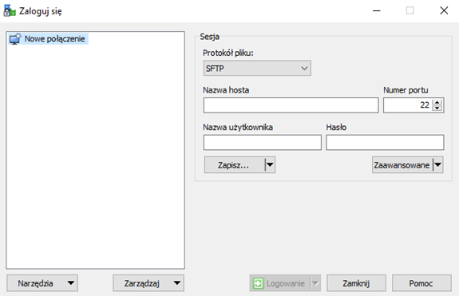
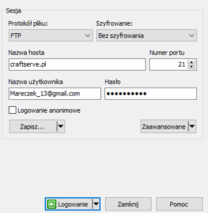
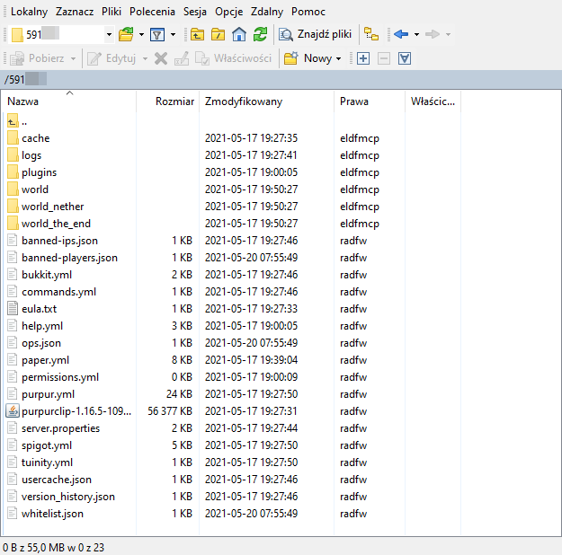
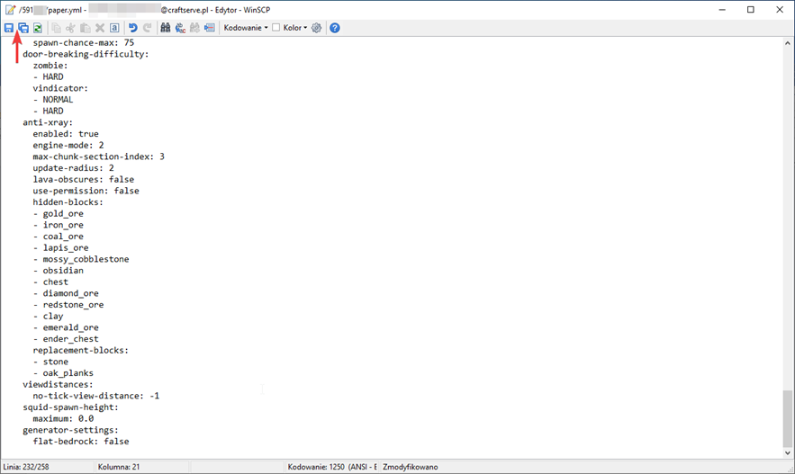

# Poradnik FTP - Łączenie się z Craftserve

Najwygodniejszym sposobem na edycję plików serwerowych jest skorzystanie z FTP. Jednym z 
najlepszych programów, które obsługują ten protokół, jest WinSCP.

## Instalacja
Aby go pobrać należy wejść na [tę stronę](https://winscp.net/eng/download.php). Następnie trzeba 
kliknąć guzik **DOWNLOAD**.

## Logowanie się do serwera
Po zainstalowaniu programu i otworzeniu go powinno nam wyskoczyć takie okno:

Jeśli jednak go nie mamy albo przypadkowo je zamkniemy należy, je włączyć klikając przycisk **Nowa sesja** w lewym górnym rogu programu.

Żeby połączyć się z naszym serwerem trzeba:
- Wybrać w **Protokół pliku**: FTP
- Wpisać w **Nazwa hosta**: craftserve.pl
- Wpisać w **Nazwa użytkownika**: adres e-mail naszego konta Craftserve
- Wpisać w **Hasło**: hasło do naszego konta Craftserve
- Wybrać port **21**
Przykład poprawnego uzupełnienia:

Po wypełnieniu formularza logujemy się klikając przycisk **Logowanie**. Jeśli wszystko zostało poprawnie wykonane powinniśmy połączyć się z serwerem.

## Jak korzystać
Okno WinSCP podzielone jest na dwie części - część plików lokalnych (nasz komputer) oraz zdalnych (serwer):

W oknie oznaczonym numerem **1** znajdują się pliki, które są na naszym komputerze. Możemy dzięki temu szybko dostać się do jakiegoś folderu albo dysku.

Okno **2** to pliki serwerowe - każdy folderów z numeryczną nazwą odpowiada serwerowi przypisanemu do konta (np. `000001` to pliki serwera `s000001.csrv.pl`). 

Żeby dostać się do plików danego serwera należy otworzyć odpowiedni folder:

Aby wgrać jakiś plik na serwer wystarczy go przenieść z okna pierwszego do drugiego lub z pulpitu do okna drugiego. 

Klikając dwa razy na **plik tekstowy** możemy go edytować. Po zmianach trzeba pamiętać o zapisaniu go. Można to zrobić za pomocą skrótu klawiszowego **Ctrl + S** lub za pomocą przycisku w lewym górnym rogu: 

## Uwagi

Żeby serwer wczytał wszystkie nasze zmiany należy go **zrestartować**. Używanie komendy `/reload` **nie jest bezpieczne** na serwerach z modami lub pluginami, często powodując błędy.

Aby pobrać plik z serwera na nasz komputer trzeba zaznaczyć plik i kliknąć **F5** - to przerzuci zaznaczony plik do katalogu otwartego w lewej części WinSCP. Bardziej intuicyjną jest też możliwość przeciągnięcia danego pliku na nasz pulpit lub do jakiegoś folderu.

**UWAGA** Wgrywanie własnego silnika zakończy się niepowodzeniem. Craftserve zezwala wyłącznie na używanie silników znajdujących się w zakładce **Ustawienia/Silniki**. Jeśli potrzebny jest silnik, którego nie ma w tej zakładce, można napisać do supportu z prośbą o wgranie go.
