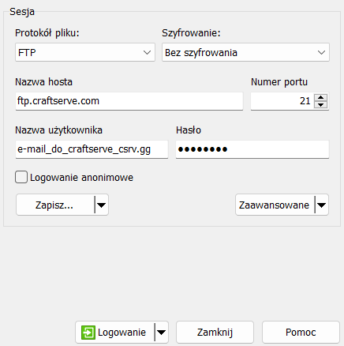

# Poradnik FTP - Łączenie się z Craftserve

Najwygodniejszym sposobem na edycję plików serwerowych jest skorzystanie z FTP. Jednym z 
najlepszych programów, które obsługują ten protokół, jest WinSCP.

## Instalacja
Aby go pobrać należy wejść na [tę stronę](https://winscp.net/eng/download.php). Następnie trzeba 
kliknąć guzik **DOWNLOAD**.

## Logowanie się do serwera
Po zainstalowaniu programu i otworzeniu go powinno nam wyskoczyć takie okno:

Jeśli jednak go nie mamy albo przypadkowo je zamkniemy należy, je włączyć klikając przycisk **Nowa sesja** w lewym górnym rogu programu.

Żeby połączyć się z naszym serwerem trzeba:
- Wybrać w **Protokół pliku**: FTP
- Wpisać w **Nazwa hosta**: craftserve.pl
- Wpisać w **Nazwa użytkownika**: adres e-mail naszego konta craftserve
- Wpisać w **Hasło**: hasło do naszego konta craftserve
- Wybrać port **21**
Przykład poprawnego uzupełnienia:

Po wypełnieniu logujemy się klikając przycisk **Logowanie**. Jeśli wszystko zostało poprawnie wykonane powinniśmy widzieć nasz serwer.

## Jak korzystać

W oknie oznaczonym numerem **1** znajdują się pliki, które są na naszym komputerze. Możemy dzięki temu szybko dostać się do jakiegoś folderu albo dysku.

W oknie oznaczonym numerem **2** są pliki serwerowe. 

Żeby się do nich dostać wystarczy otworzyć folder, który jest nazwany liczbą. Jest to jego numer. Każdy serwer ma swój unikalny numer. Aby wgrać jakiś plik na serwer wystarczy go przenieść z okna pierwszego do drugiego lub z pulpitu do okna drugiego. Klikając dwa razy na plik tekstowy możemy go edytować. Po zmianach trzeba pamiętać o zapisaniu go. Można to zrobić za pomocą skrótu klawiszowego **Ctrl + S** lub za pomocą przycisku w lewym górnym rogu. 

Żeby serwer wczytał wszystkie nasze zmiany należy go zrestartować.

Aby pobrać plik z serwera na nasz komputer trzeba zaznaczyć plik i kliknąć **F5** albo przeciągnąć go na nasz pulpit lub do jakiegoś folderu.

**UWAGA** Wgrywanie własnego silnika zakończy się niepowodzeniem. Craftserve pozwala korzystać wyłącznie z silników, które znajdują się w zakładce **Ustawienia/Silniki**. Jeśli potrzebny na serwer jest silnik, którego nie ma w tej zakładce, można napisać do supportu z prośbą o wgranie go.
