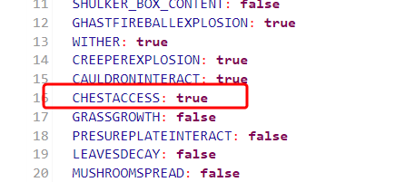

# Instalacja i konfiguracja LogBlocka na Craftserve

### Wymagania

* Serwer Minecraft wspierający pluginy (Spigot, Paper, Purpur, etc.)
* Plugin LogBlock
* Stworzona baza danych MySQL (panel Craftserve -> Ustawienia -> MySQL -> Utwórz)

### Instalacja oraz podłączenie do bazy danych

1. Wyłącz serwer.
2. Pobierz plugin LogBlock na swoją wersję serwera:
    - [1.13.2](https://www.iani.de/jenkins/job/LogBlock/64/artifact/target/LogBlock.jar)
    - [1.14.4](https://www.iani.de/jenkins/job/LogBlock/90/artifact/target/LogBlock.jar)
    - [1.15.2](https://www.iani.de/jenkins/job/LogBlock/99/artifact/target/LogBlock.jar)
    - [1.16.5](https://www.iani.de/jenkins/job/LogBlock/132/artifact/target/LogBlock.jar)
    - [1.17.1/1.18.2](https://www.iani.de/jenkins/job/LogBlock/161/artifact/target/LogBlock.jar)
    - [1.19](https://www.iani.de/jenkins/job/LogBlock/lastSuccessfulBuild/artifact/target/LogBlock.jar)
3. Umieść pobrany plugin w folderze `plugins` na serwerze. Możesz skorzystać z [FTP](ftp.md), lub panelu Craftserve (zakładka Pliki).
4. Uruchom serwer.
5. Jeśli nie pojawi się w konsoli komunikat: 
   ```
   [de.diddiz.lib.com.zaxxer.hikari.HikariDataSource] LogBlock-Connection-Pool - Start completed.
   ```
   to znaczy, że plugin nie został skonfigurowany automatycznie przez Craftserve. **Uruchom serwer ponownie**.
6. Jeśli nadal nie pojawia się komunikat z punktu 5, to znaczy, że plugin nie został skonfigurowany automatycznie. Skonfiguruj go ręcznie:
    - Wyłącz serwer.
    - W folderze `plugins/LogBlock` znajduje się plik `config.yml`. Otwórz go.
    - W pliku znajduje się sekcja `mysql`. Wypełnij ją danymi z panelu Craftserve (zakładka Ustawienia -> MySQL).
    
      Wartości `host`, `port`, `requireSSL` oraz `useSSL` są takie same dla każdego serwera na Craftserve - jak na zdjęciu wyżej.
    - Zapisz plik.
    - Uruchom serwer.

### Konfiguracja

#### Uprawnienia

By możliwe było sprawdzanie historii zmian bloków drewnianym kilofem, graczom trzeba nadać odpowiednie uprawnienia. W tym celu należy użyć pluginu [LuckPerms](https://luckperms.net/).

Nadawać uprawnienia można następująco:

Dla wszystkich graczy:
```
/lp group default permission set PERMISJA
```

Dla konkretnego gracza:
```
/lp user GRACZ permission set PERMISJA
```

Najczęściej używane uprawnienia pluginu LogBlock:

| Permisja            | Opis                                                                                                                                                     |
|---------------------|----------------------------------------------------------------------------------------------------------------------------------------------------------|
| logblock.lookup     | umożliwia wyszukiwanie informacji o historii zmian danego bloku za pomocą komendy /lb lookup                                                             |
| logblock.tools.tool | umożliwia dostęp do komendy /lb tool w celu przywołania drewnianego kilofa oraz na korzystanie z niego w celu sprawdzania nim historii klikniętego bloku |
| logblock.spawntools | przydatna w celu zablokowania możliwości przywołania drewnianego kilofa (ustawiana na false)                                                             |

Reszta uprawnień znajduje się w [dokumentacji pluginu](https://github.com/LogBlock/LogBlock/wiki/Permissions).

Przykładowe użycie komendy nadawania uprawnień:
```
/lp group default permission set logblock.lookup
/lp group default permission set logblock.tools.tool
```
### Zapisywanie historii zmian w skrzyniach

Domyślnie plugin nie zapisuje historii zmian w skrzyniach. Aby to zmienić, wykonaj następujące kroki:

1. Otwórz plik `world.yml`(plik ten nosi nazwę świata) w folderze `plugins/LogBlock`.
2. Odnajdź `CHESTACCESS` i ustaw wartość na `true`.

   
3. Zapisz plik.
4. Uruchom ponownie serwer.

Proces ten należy powtórzyć dla każdego świata na serwerze.

### Uwagi

* [Dokumentacja pluginu](https://github.com/LogBlock/LogBlock/wiki)
* [Strona pluginu na spigotmc.org](https://www.spigotmc.org/resources/logblock.67333/)