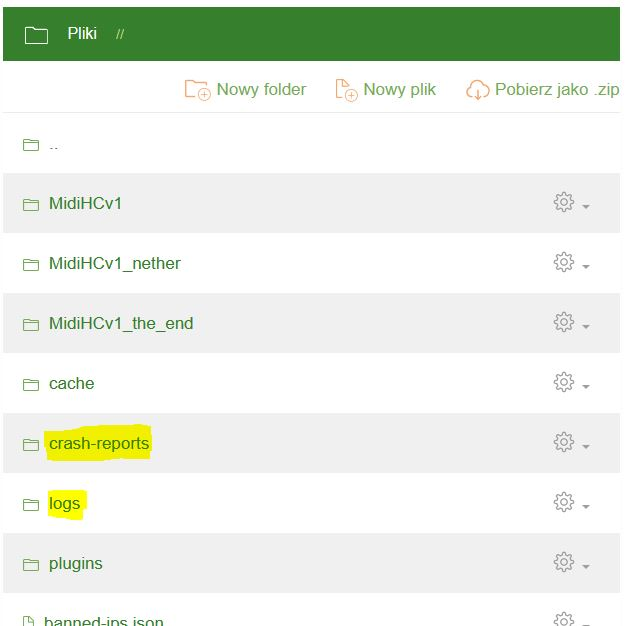

Logi
====
Twój serwer scrashował albo wykrzaczył się plugin? Pierwszym miejscem do którego powinieneś się udać są foldery **/logs/** i **/crash-reports/** na Twoim serwerze:

Każdy plik w folderze **/logs/** zawiera pełny log z danego uruchomienia Twojego serwera. Najważniejszy jest plik **latest.log** (**fml-server-latest.log** na niektórych wersjach Forge) - zawiera on informacji z najnowszej sesji serwera. 

Raporty z crashy znajdziesz natomiast w folderze **crash-reports** - ich nazwy opatrzone są datą i godziną crashu. Crash-report zawiera to skróconą wersję logu oraz okoliczności w jakich serwer scrashował.

# PAMIĘTAJ!
**Wyślij plik *latest.log*** zanim zadasz jakiekolwiek pytanie o scrashowany serwer lub niedziałający plugin na naszym Discordzie. Znajomość języka angielskiego bardzo czesto wystarczy, by samemu dowiedzieć się w czym problem. Warto samemu czytać logi.
