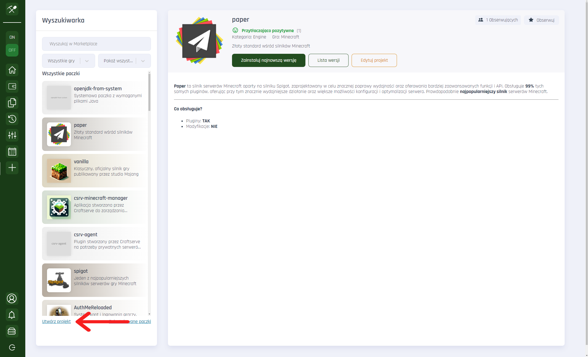
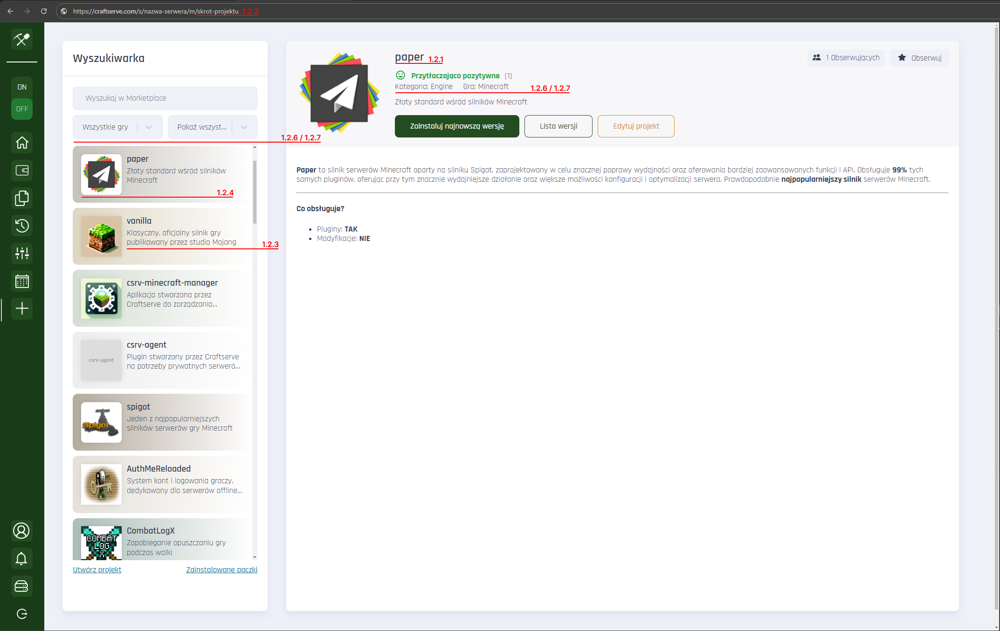
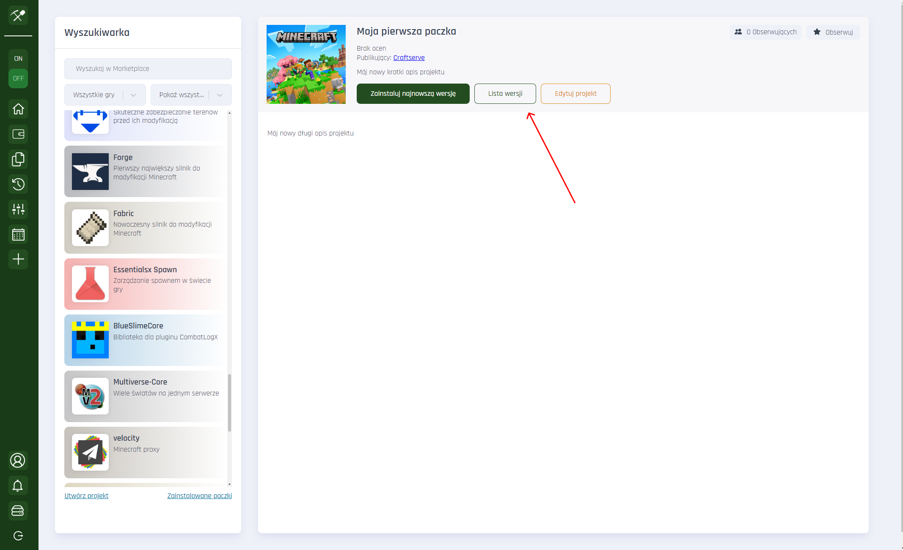
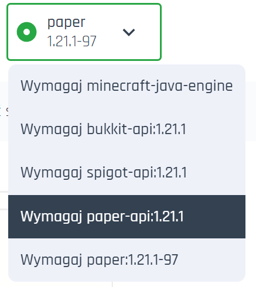

### Jak stworzyć paczkę na Craftserve Marketplace?

Uwaga: Tworzenie projektów i wersji wymaga zakupionej usługi

1.1 Wejdź do panelu zarządzania serwerem, następnie w marketplace, oraz kliknij
odnośnik “Utwórz projekt”

1.2 W kreatorze projektu wypełnij poszczególne pola

1.2.1 **Nazwa projektu** – Wyświetla się w marketplace, oraz dzięki temu polu
użytkownicy będą mogli wyszukiwać Twój projekt po nazwie.

1.2.2 **Skrót** - te pole wypełnia się automatycznie względem nazwy którą wypełnisz,
odpowiada ono za identyfikacje projektu w linku.

1.2.3 **Krótki opis** – To będzie druga rzecz którą zobaczy użytkownik szukając paczek w
marketplace. Wyświetla się pod tytułem w liście paczek i to dzięki niemu możesz
przyciągnąć kogoś uwagę. Powinien zawierać krótki opis na czym skupia się Twój
projekt.

1.2.4 **Ikona projektu** - przyciąga uwagę i jest niejako wizytówką Twojej paczki!

1.2.5 **Widoczność projektu**

- **Publiczny** : Dostępny dla każdego, wyświetla się w liście paczek
  marketplace
- **Niepubliczny** : Nie wyświetla się w liście paczek marketplace, ale jest możliwy
  do udostępnienia przez link.
- **Prywatny** : Dostępny tylko dla Ciebie.
  **\*Jako autor projektu, zawsze będziesz widział swój projekt w liście
  projektów na marketplace. Bez względu jaką widoczność wybierzesz.**

  1.2.6 **Kategoria projektu** – powinna jak najbliżej precyzować czym jest Twoja paczka.
  Dzięki określeniu kategorii Twoja paczka będzie mogła być filtrowana po kategorii.

  1.2.7 **Gra** - Określa do jakiej gry jest przeznaczona Twoja paczka.

  1.2.8 **Szczegółowy opis projektu** – skorzystaj z edytora markdown, aby w pełni opisać
  swój projekt. Uwzględnij czego wymaga Twoja paczka, oraz na czym się skupia, lub jaki
  problem rozwiązuje. Jeśli nie wiesz dokładnie jak działa Markdown skorzystaj z
  https://www.markdownguide.org/cheat-sheet/

  

  1.3 Gdy uzupełnisz swój projekt, kliknij przycisk “Opublikuj”, aby zatwierdzić zmiany.

  1.4 Gotowe! Aby zobaczyć swój projekt wejdź na marketplace i wyszukaj go w
  wyszukiwarce.

  1.5 Masz już swój projekt, ale brakuje w nim wersji, czyli brakuje dodanych plików do
  projektu, które zostaną pobrane w momencie gdy użytkownik będzie chciał ją
  zainstalować na swoim serwerze. Aby dodać wersję wejdź w swój projekt, następnie
  kliknij “Lista wersji”

  

  1.6 Kliknij “Dodaj wersję”

  1.7 Kreator wersji projektu składa się z następujących pól:

  1.7.1 **Typ wersji**

- **Stable** oznacza wersję stabilną, która przeszła pełne testy. Jest ona
  skierowana do użytkowników którzy oczekują w pełni działającej paczki.
- **Private** oznacza, że wersja jest prywatna, skierowana dla danej grupy
  odbiorców np. Programistów, lub Twoich testerów. Nie musi być stabilna, może
  wymagać np. Dodatkowych testów.
- **Latest** to najnowsza wersja, może być stabilna lub nie. Kierowana dla
  użytkowników, którzy chcą najnowszych funkcji.

  1.7.2 **Wersja projektu** np. Numer. To twoja decyzja jak oznaczasz swoje wersje.

  1.7.3 **Serwer** – wybierz serwer z którego chcesz udostępnić pliki do paczki. Wybrane
  pliki zostaną zainstalowane na serwerze użytkownika, który zainstaluje Twoją paczkę.

  1.7.4 **Wybierz paczki** , które mają zostać zainstalowane przed zainstalowaniem Twojej
  paczki. Wykrywamy automatycznie jakie paczki posiadasz zainstalowane na swoim
  serwerze z którego wgrywasz pliki. Zaznacz jeśli Twoja paczka wymaga do działania
  jakiejś innej paczki, lub silnika / wersji gry.

- **Przykład** : Moja paczka to mapa serwera z kilkoma dodatkowymi pluginami. Wiem, że
  moje pluginy wymagają silnika Paper na wersji 1.12.1. Dodatkowo chciałbym, aby
  wymagane od użytkownika była powyższa wersja, ponieważ jeśli będzie posiadał
  starszą to mapa może zostać źle wczytana. Wybieram więc:

  

Jeśli wiesz, że Twoje pliki wymagają przykładowo silnika spigot w wersji 1.21.1 to zaznacz spigot-api w wersji 1.21.1. Jeśli
natomiast chcesz, aby zależność była weryfikowana razem z wersją builda wybierz opcję która kończy się "-" przykład: paper:1.12.1-97
Wymagane wtedy będzie, aby użytkownik posiadał paczkę spigot w wersji 1.21.1 o buildzie 97.

Gdy użytkownik będzie chciał zainstalować Twoją paczkę zostanie sprawdzona
kompatybilność z jego serwerem względem tego jakie wymagania zaznaczysz.

1.7.5 **Szczegółowy opis** : Tutaj możesz opisać dokładnie czego wymaga Twoja wersja,
oraz opisać co zmieniło się np. Względem starszej wersji. Pamiętaj, aby dokładnie
uzupełniać swoje opisy.

1.7.6 Gdy wszystkie pola zostały uzupełnione, kliknij przycisk “ **Dodaj wersję** ”.

1.8 Wersja została utworzona i jest teraz dostępna do pobrania. **Gratulacje**!
