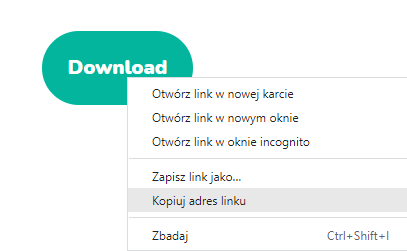
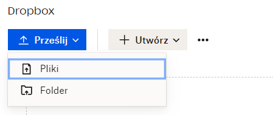
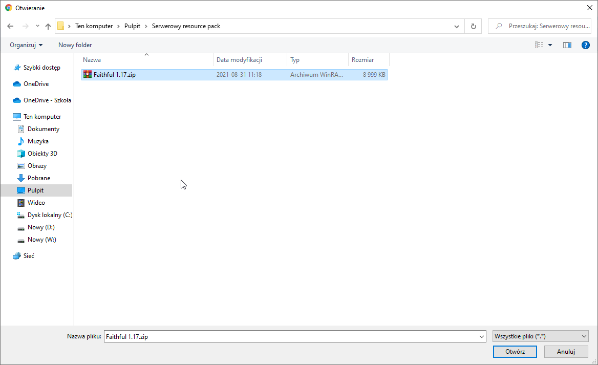

# Serwerowy resource pack
## Link do pobrania
### Publicznego resource packa

Żeby wgrać na serwer resource packa potrzebujemy bezpośredniego linku do pobrania go. Aby go zdobyć, należy kliknąć prawym przyciskiem myszy na przycisk, 
który spowoduje pobranie danej paczki zasobów. Następnie kopiujemy adres linku.

### Resource packa z komputera

Jeśli chcemy wgrać na serwer własną paczkę zasobów, to trzeba ją przesłać na dowolny serwis, ale musi on udostępniać możliwość bezpośredniego permalinku do pobrania. Można skorzystać np. z [Dropboxa](https://www.dropbox.com/). 
Żeby to zrobić należy:
* Przeciągnąć naszego resource packa na środek strony lub kliknąć przycisk **prześlij**

* Wybrać **pliki**

* Szukamy interesującej nas paczki

* Następnie naciskamy **otwórz**

Teraz kopiujemy link do naszej paczki klikając przycisk **kopiuj łączę**.

## Wgrywanie resource packa na serwer
Gdy mamy już nasz link przechodzimy do serwerowego pliku **server.properties**. Znajduje się on w głównym katalogu naszego serwera.
Szukamy linijki **resource-pack=** i tam go wklejamy.

# WAŻNE
Jeśli korzystamy z Dropboxa, to na końcu linku trzeba zamienić **0** na **1**.
