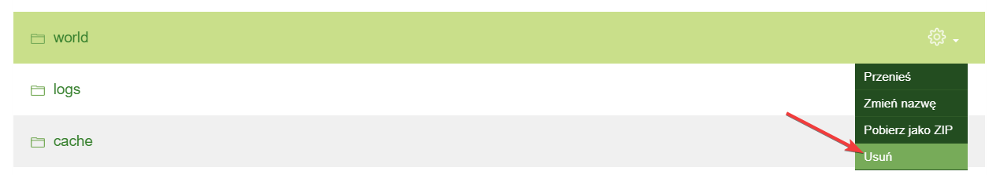
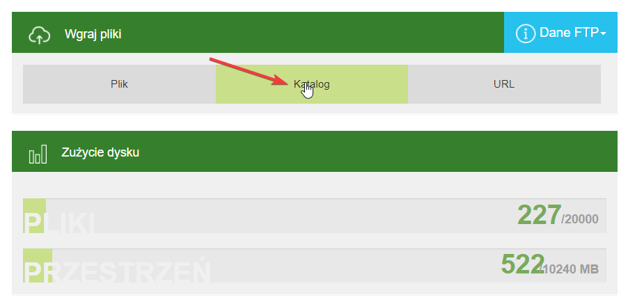
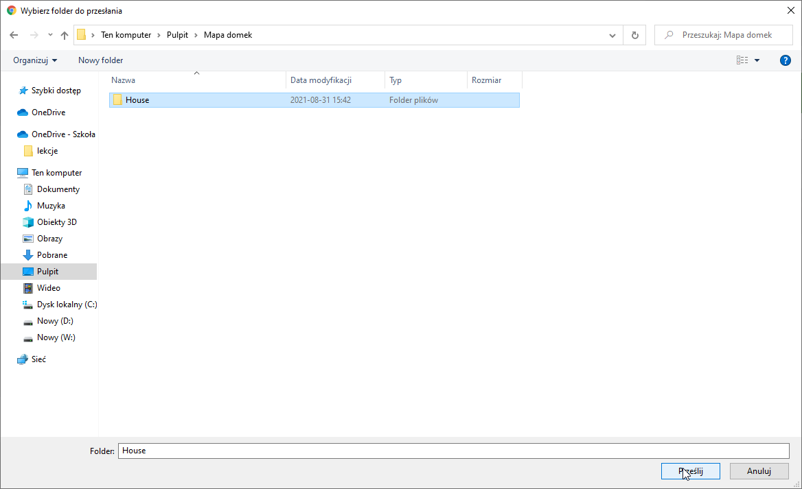
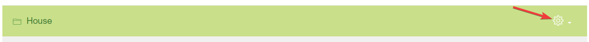
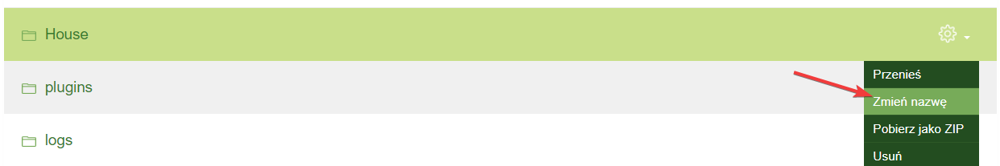
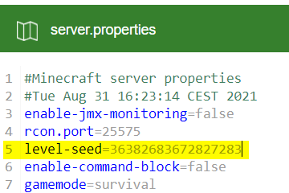

# Świat serwerowy
## Spis treści
* [Tworzenie nowego świata](#tworzenie)
* [Wgrywanie własnej mapy](#wgrywanie)
* [Ustawienie własnego seedu](#seed)
* [Przeniesienie świata z serwera na singleplayer](#dim)

## Tworzenie nowego świata
Aby utworzyć nową mapę należy:
* Wyłączyć serwer
* Wejść w pliki serwera
* Usunąć świat usuwając foldery **world**, **world_nether** oraz **world_the_end**. Jeśli nazwa świata została zmieniona w pliku **server.properties** lub w panelu serwera, to usuwamy foldery **<c. nazwa>**, **<c. nazwa>_nether** oraz **<c. nazwa>_the_end**. (Jeżeli chcemy zachować mapę, to najlepiej będzie ją pobrać na nasz komputer najlepiej za pomocą **[FTP](https://github.com/Craftserve/docs/blob/master/ftp.md)**).

* Jeżeli w pliku **server.properties** w linijce **level-seed** jest ustawiony seed świata, należy go usunąć, a następnie zapisać plik, żeby wygenerował się nowy, inny. Inaczej zresetuje się tylko nasz postęp.
* Włączamy serwer

## Wgrywanie własnej mapy
Aby wgrać swój własny świat należy:
* Wyłączyć serwer
* Wejść w pliki serwera
* Usunąć stary świat (Informacje jak to zrobić znajdują sie powyżej)
* Wgrać swój do głównego folderu serwera

(Gdy postęp wgrywania będzie wynosił 100%, to oznacza to, że plik został wgrany. Trzeba wtedy kliknąć **X**. Inaczej informacja ta nie zniknie.)

* Następnie zmienić nazwę folderu na **world**

* Włączyć serwer

## Ustawienie własnego seedu
Aby ustawić własny seed należy:
* Wyłączyć serwer
* Wejść do głównego katalogu serwera
* Otworzyć plik **server.properties**
* Wpisać w linijce **level-seed=** swój seed

* Zapisać plik
* Usunąć stary świat (informacje o tym jak to zrobić znajdują się na samej górze)
* Włączyć 

## Przenoszenie świata z serwera na singleplayer
Aby przenieść świat z serwer na swój komputer należy:
* Pobrać nasz świat
* Wejść w folder netheru, a następnie pobrać folder **DIM-1**
* Wejść w folder endu, a następnie pobrać folder **DIM1**
* Wcisnąć skrót klawiszowy **Windows + R** i wpisać: **%appdata%**
* Otworzyć folder **.minecraft**, a w nim folder **saves**
* Wgrać tam świat, który pobralismy
* Wrzucić do niego foldery **DIM-1** oraz **DIM1**

