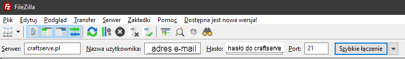

Instalacja pluginów
==============================
**Panel CraftServe** co prawda posiada zakładkę automatycznej instalacji pluginów, jednak funkcja ta nie działa najlepiej. Instalacja często ***nie dobiega do końca***, a jeśli już się to uda, to zainstalowana wersja pluginu ***nie jest obsługiwana*** przez dany silnik.

Dlatego, by zainstalować pluginy najlepiej jest to zrobić tradycyjną metodą - wykorzystując **FTP** lub zakładkę **Pliki** w panelu CraftServe. Do uruchomienia pluginów potrzebujemy jeden z silników obsługujących je, np:
Bukkit, Spigot i Paper
------------------------
Pluginy na te silniki można pobrać ze stron [Bukkit.org](https://dev.bukkit.org/bukkit-plugins) oraz [SpigotMC](https://www.spigotmc.org/resources/categories/spigot.4/). Inne strony zamiast pluginów mogą wysłać nam szkodliwe oprogramowanie.

Przed pobraniem pluginu należy się upewnić, że działa on na naszej wersji Minecrafta, a już pobrane pluginy z rozszerzeniem **.jar** należy przekopiować do folderu **/plugins/** Na naszym serwerze.
Sponge
--------------------
Silnik sponge ma API zupełnie różne od Bukkit, Spigot czy Paper, dlatego pluginy z tych silników nie są między sobą kompatybilne. Wtyczki Sponge można ściągnąć ze strony [SpongePowered](https://ore.spongepowered.org/), by je zainstalować wystarczy odpowiednią wersję wrzucić do folderu **/plugins/** na naszym serwerze.

Niestety, biblioteka pluginów Sponge'a jest zdecydowanie uboższa, niż ta Bukkita i Spigota.
Instalacja
----------
Do zarządzania plikami można wykorzystać zakładkę **Pliki** w panelu CraftServe lub protokół **FTP** i obsługującego go klienta, np. **FileZilla**:
