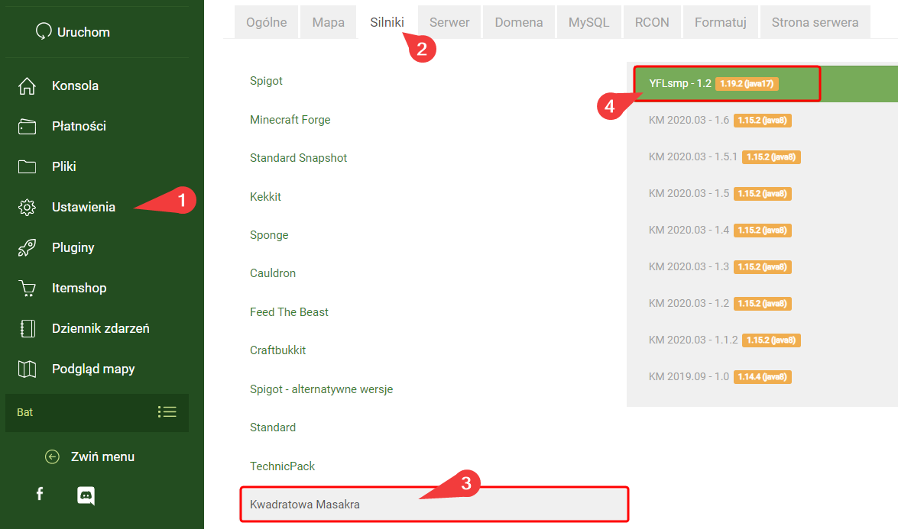
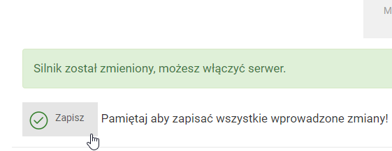
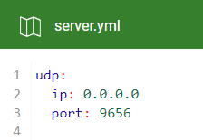

# Instalacja paczki YFLsmp

### Wymagania

* Serwer Minecraft na Craftserve działający na pakiecie Diamond 

### Instalacja na serwerze

1. Usuń obecne pliki map z serwera. Można posłużyć się funkcją **Formatuj** -> **Wszystkie pliki**, znajdziesz ją w ustawieniach.
   *Uwaga: Formatowanie serwera spowoduje utratę wszystkich obecnych plików, w tym wszystkich elementów zapisanych na mapie.*

   
2. Wybierz silnik YFLsmp.
    - Silnik ten możesz ustawić w zakładce **Ustawienia** -> **Silniki** -> **Kwadratowa Masakra** panelu Craftserve.

      
    - Należy pamiętać o zapisaniu silnika po jego wyborze. W tym celu udaj się na dół strony i kliknij przycisk **Zapisz**.

      

3. Przejdź do panelu Craftserve i wybierz zakładkę **Pliki**.
4. Odszukaj folder `config/PlasmoVoice` oraz otwórz plik `server.yml`.
   - w polu `udp.port` ustaw wartość pomiędzy 8000 a 10000.
   
     
5. Uruchom serwer.

### Instalacja na komputerach graczy

By można było dołączyć do serwera, gracz musi mieć zainstalowaną paczkę YFLsmp. Podążaj za poniższymi krokami:
1. [Pobierz TechnicLauncher](https://www.technicpack.net/download).
2. Zainstaluj TechnicLauncher. Do uruchomienia wymagana jest Java wersji 8, najlepiej w środowisku [Adoptium](https://adoptium.net/en-GB/temurin/releases/?version=8).
3. Uruchom TechnicLauncher i zaloguj się do niego.
4. W zakładce **Modpacks** w wyszukiwarce wklej poniższy link: 
    ```
    https://www.technicpack.net/modpack/yflsmp-csrv.1959773
    ```
5. Zainstaluj paczkę za pomocą przycisku **Install**.

   

### Uwagi
- W przypadku problemów z dołączeniem do serwera, spróbuj powtórzyć instalację na serwerze.
